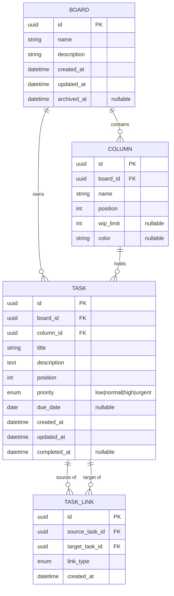

# Пакет проектной документации: персональный Kanban-трекер (MVP)

> Версия 0.1 · Статус: черновик для согласования · Аудитория: разработчик(и), дизайнер, будущий «я»

---

## 0. Состав пакета документации

Для легковесного персонального продукта избыточная документация вредна. Ниже — минимально достаточный набор, каждый документ отвечает на один вопрос.

| № | Документ | На какой вопрос отвечает | Объём |
|---|----------|--------------------------|-------|
| 1 | Product Vision | Зачем делаем и что НЕ делаем | 1 стр. |
| 2 | Глоссарий и доменная модель | Из каких сущностей состоит система | 1–2 стр. |
| 3 | Функциональные требования (user stories + AC) | Что система должна уметь | 3–5 стр. |
| 4 | Нефункциональные требования | Какими качествами обладать | 1 стр. |
| 5 | Модель данных | Как хранятся данные | 2 стр. |
| 6 | API-контракт | Как клиент общается с ядром | 2–3 стр. |
| 7 | Архитектурная записка (ADR-стиль) | Как устроена система и почему | 2 стр. |
| 8 | UX-спецификация | Как выглядят экраны и взаимодействия | 2–3 стр. |
| 9 | План развития (MCP, календарь) | Куда движемся после MVP | 1–2 стр. |
| 10 | Стратегия тестирования и Definition of Done | Когда MVP считается готовым | 1 стр. |

Далее — содержимое каждого документа.

---

## 1. Product Vision

**Проблема.** Существующие таск-трекеры (Jira, Trello, Notion) либо перегружены командной функциональностью, либо требуют облачного аккаунта. Нужен быстрый персональный инструмент с полным контролем над данными, готовый к работе через AI-агента.

**Продукт.** Легковесное приложение персонального kanban-трекинга: доски → колонки (этапы) → задачи со связями между ними.

**Целевой пользователь.** Один человек (владелец = единственный пользователь). Мультипользовательность, роли, шаринг — вне скоупа.

**Ключевые принципы.**
- *Скорость важнее функций*: любое действие ≤ 2 кликов / 1 команды.
- *Данные принадлежат пользователю*: локальное хранилище или self-hosted, экспорт в открытом формате.
- *API-first*: вся функциональность доступна через API — это фундамент для MCP-интерфейса.

**Вне скоупа MVP:** комментарии, вложения, уведомления, мобильное приложение, offline-синхронизация между устройствами, спринты/оценки. *(Обновление: пользователи и авторизация реализованы после MVP — обязательный JWT-вход по email+паролю и через Google OAuth, доски принадлежат пользователям.)*

**Метрики успеха MVP (личные):** ежедневное использование ≥ 2 недель подряд; создание задачи ≤ 5 секунд; нулевая потеря данных.

---

## 2. Глоссарий и доменная модель

| Термин | Определение |
|--------|-------------|
| **Доска (Board)** | Контейнер верхнего уровня, объединяет колонки и задачи одного контекста (например, «Работа», «Дом») |
| **Колонка / Этап (Column)** | Именованный статус на доске с фиксированной позицией; задача всегда находится ровно в одной колонке |
| **Задача (Task)** | Единица работы: заголовок, описание, приоритет, срок; принадлежит доске и колонке |
| **Связь (Task Link)** | Направленное типизированное отношение между двумя задачами |
| **WIP-лимит** | Необязательное ограничение числа задач в колонке (мягкое: предупреждение, не блокировка) |
| **Позиция (position)** | Порядковый номер, определяющий сортировку колонок на доске и задач внутри колонки |

### Типы связей

| Тип | Семантика | Обратное представление | Ограничения |
|-----|-----------|------------------------|-------------|
| `blocks` | A блокирует B | B «заблокирована» A | запрет циклов |
| `subtask_of` | A — подзадача B | B «содержит» A | запрет циклов; одна задача — не более одного родителя |
| `relates_to` | A связана с B | симметричная | — |
| `duplicates` | A дублирует B | B «дублируется» A | — |

Общие правила связей: запрет связи задачи с самой собой; запрет дубликата пары (source, target, type); связи допускаются между задачами разных досок.

### Диаграмма доменной модели



---

## 3. Функциональные требования

Формат: user story + критерии приёмки (AC). Приоритеты по MoSCoW.

### Эпик A. Доски

**US-A1 (Must).** Как пользователь, я хочу создать доску с названием, чтобы разделять контексты задач.
- AC1: название обязательно, 1–100 символов; описание опционально.
- AC2: новая доска создаётся с колонками по умолчанию: «Backlog», «В работе», «Готово» (настраивается флагом «создать пустой»).
- AC3: доска появляется в списке досок без перезагрузки страницы.

**US-A2 (Must).** Редактирование названия и описания доски.
- AC1: изменения сохраняются и видны немедленно; `updated_at` обновляется.

**US-A3 (Must).** Удаление доски.
- AC1: удаление требует подтверждения с указанием числа задач на доске.
- AC2: каскадно удаляются колонки, задачи и связи, где участвуют задачи этой доски.
- AC3 (Should): вместо жёсткого удаления доступна архивация (`archived_at`), архивные доски скрыты из списка по умолчанию.

### Эпик B. Колонки / этапы

**US-B1 (Must).** Создание колонки на доске с названием и позицией.
- AC1: название 1–50 символов, уникальность в пределах доски не требуется, но UI предупреждает о дубликате.
- AC2: новая колонка добавляется в конец, позиция вычисляется автоматически.

**US-B2 (Must).** Редактирование колонки: название, цвет, WIP-лимит.

**US-B3 (Must).** Изменение порядка колонок drag-and-drop.
- AC1: позиции остальных колонок пересчитываются атомарно.

**US-B4 (Must).** Удаление колонки.
- AC1: если в колонке есть задачи — пользователь выбирает: перенести задачи в другую колонку или удалить вместе с колонкой.
- AC2: последнюю колонку доски удалить нельзя (ошибка 409).

### Эпик C. Задачи

**US-C1 (Must).** Быстрое создание задачи: заголовок + колонка, остальное — по умолчанию.
- AC1: создание из формы «в одну строку» внизу колонки; Enter — создать, Esc — отменить.
- AC2: заголовок 1–200 символов.

**US-C2 (Must).** Редактирование задачи: заголовок, описание (markdown), приоритет, срок.
- AC1: карточка открывается в модальном окне / боковой панели; автосохранение или явное «Сохранить» — решение зафиксировать в UX-спеке.

**US-C3 (Must).** Перемещение задачи между колонками и внутри колонки (drag-and-drop и через меню).
- AC1: при переносе в колонку с достигнутым WIP-лимитом показывается предупреждение, но перенос разрешён.
- AC2: перенос в колонку, помеченную как «финальная» (Should), проставляет `completed_at`.

**US-C4 (Must).** Удаление задачи с подтверждением; все её связи удаляются каскадно.

**US-C5 (Should).** Фильтрация и поиск задач на доске: по тексту, приоритету, сроку.

### Эпик D. Связи между задачами

**US-D1 (Must).** Добавление связи из карточки задачи: выбор типа + поиск целевой задачи по названию.
- AC1: система запрещает self-link и дубликаты — ошибка с понятным текстом.
- AC2: для `blocks` и `subtask_of` система проверяет отсутствие цикла (поиск по графу); при цикле — ошибка 422 «Связь создаёт цикл: A → B → A».

**US-D2 (Must).** Просмотр связей в карточке задачи, сгруппированных по типу, с обратной формулировкой («Заблокирована задачей X»).

**US-D3 (Must).** Удаление связи из карточки любой из двух задач.

**US-D4 (Should).** Индикатор на карточке в колонке: значок «заблокирована», если есть активные (не завершённые) блокирующие задачи.

---

## 4. Нефункциональные требования

| Категория | Требование |
|-----------|------------|
| Производительность | Отклик UI на действия < 100 мс; открытие доски со 100 задачами < 500 мс; поддержка до 50 досок / 5 000 задач без деградации |
| Надёжность | Все мутации атомарны (транзакции); при сбое записи пользователь получает ошибку, данные не повреждаются |
| Хранение | Единый файл БД (SQLite) — тривиальный бэкап копированием файла |
| Переносимость данных | Экспорт/импорт всей БД в JSON (Should) |
| Безопасность | Обязательная JWT-аутентификация (email+пароль, Google OAuth); ~~статический bearer-токен~~ заменён; HTTPS на стороне reverse-proxy |
| Совместимость | Десктопные браузеры Chrome/Firefox/Safari последних 2 версий; адаптив под планшет — Could |
| Локализация | RU-интерфейс; тексты вынесены в словарь для будущей i18n |
| Наблюдаемость | Структурные логи запросов и ошибок; уровень настраивается |

---

## 5. Модель данных (SQLite)

```sql
CREATE TABLE boards (
    id          TEXT PRIMARY KEY,            -- uuid v4
    name        TEXT NOT NULL CHECK(length(name) BETWEEN 1 AND 100),
    description TEXT DEFAULT '',
    created_at  TEXT NOT NULL,               -- ISO 8601 UTC
    updated_at  TEXT NOT NULL,
    archived_at TEXT
);

CREATE TABLE columns (
    id        TEXT PRIMARY KEY,
    board_id  TEXT NOT NULL REFERENCES boards(id) ON DELETE CASCADE,
    name      TEXT NOT NULL CHECK(length(name) BETWEEN 1 AND 50),
    position  INTEGER NOT NULL,
    wip_limit INTEGER CHECK(wip_limit IS NULL OR wip_limit > 0),
    color     TEXT
);
CREATE INDEX idx_columns_board ON columns(board_id, position);

CREATE TABLE tasks (
    id           TEXT PRIMARY KEY,
    board_id     TEXT NOT NULL REFERENCES boards(id)  ON DELETE CASCADE,
    column_id    TEXT NOT NULL REFERENCES columns(id),
    title        TEXT NOT NULL CHECK(length(title) BETWEEN 1 AND 200),
    description  TEXT DEFAULT '',
    position     INTEGER NOT NULL,
    priority     TEXT NOT NULL DEFAULT 'normal'
                 CHECK(priority IN ('low','normal','high','urgent')),
    due_date     TEXT,
    created_at   TEXT NOT NULL,
    updated_at   TEXT NOT NULL,
    completed_at TEXT
);
CREATE INDEX idx_tasks_column ON tasks(column_id, position);
CREATE INDEX idx_tasks_board  ON tasks(board_id);

CREATE TABLE task_links (
    id             TEXT PRIMARY KEY,
    source_task_id TEXT NOT NULL REFERENCES tasks(id) ON DELETE CASCADE,
    target_task_id TEXT NOT NULL REFERENCES tasks(id) ON DELETE CASCADE,
    link_type      TEXT NOT NULL
                   CHECK(link_type IN ('blocks','subtask_of','relates_to','duplicates')),
    created_at     TEXT NOT NULL,
    UNIQUE(source_task_id, target_task_id, link_type),
    CHECK(source_task_id <> target_task_id)
);
```

**Решения, требующие фиксации:**
- **Позиционирование.** Целочисленные `position` с шагом 1 и полным пересчётом при перестановке — просто и надёжно при персональных объёмах. Альтернатива (fractional indexing) не нужна на MVP. Пересчёт — внутри транзакции.
- **Проверка циклов** для `blocks`/`subtask_of` выполняется в сервисном слое (DFS/BFS по графу связей данного типа) до вставки — SQLite не выразит это ограничение декларативно.
- **Удаление колонки с задачами** реализуется двумя сценариями API (см. §6), а не каскадом на уровне БД, поскольку `tasks.column_id` без `ON DELETE CASCADE` — намеренно.

---

## 6. API-контракт (REST, JSON)

Базовый префикс: `/api/v1`. Аутентификация: `Authorization: Bearer <JWT>` — токен выдают `POST /auth/register`, `POST /auth/login` и Google OAuth (`GET /auth/google` → callback); обязательна для всего, кроме `/health` и `/auth/*`. Ошибки — единый формат:

```json
{ "error": { "code": "LINK_CYCLE", "message": "Связь создаёт цикл: A → B → A" } }
```

### Доски
| Метод | Путь | Описание |
|-------|------|----------|
| GET | `/boards` | Список досок (`?include_archived=true`) |
| POST | `/boards` | Создать (`{name, description?, with_default_columns?: bool}`) |
| GET | `/boards/{id}` | Доска целиком: колонки + задачи (основной запрос UI) |
| PATCH | `/boards/{id}` | Обновить name / description / archived |
| DELETE | `/boards/{id}` | Удалить каскадно |

### Колонки
| Метод | Путь | Описание |
|-------|------|----------|
| POST | `/boards/{id}/columns` | Создать |
| PATCH | `/columns/{id}` | Обновить name / color / wip_limit |
| POST | `/columns/{id}/move` | `{position}` — переставить |
| DELETE | `/columns/{id}` | `?move_tasks_to={columnId}` — перенести задачи; без параметра при наличии задач → 409 |

### Задачи
| Метод | Путь | Описание |
|-------|------|----------|
| POST | `/tasks` | Создать (`{board_id, column_id, title, ...}`) |
| GET | `/tasks/{id}` | Задача + её связи |
| PATCH | `/tasks/{id}` | Частичное обновление полей |
| POST | `/tasks/{id}/move` | `{column_id, position}` — атомарное перемещение |
| DELETE | `/tasks/{id}` | Удалить |
| GET | `/boards/{id}/tasks` | Фильтры: `q`, `priority`, `due_before` |

### Связи
| Метод | Путь | Описание |
|-------|------|----------|
| POST | `/links` | `{source_task_id, target_task_id, link_type}`; 422 при цикле/дубликате/self-link |
| DELETE | `/links/{id}` | Удалить связь |

Коды: 200/201, 400 (валидация), 401, 404, 409 (конфликт состояния), 422 (доменное правило). Все мутации идемпотентно безопасны к повтору там, где это возможно (`move` — да, `create` — через optional `Idempotency-Key`, Could).

---

## 7. Архитектурная записка

### Контекст и выбор топологии

Требования «легковесность + данные у пользователя + API-first» дают две жизнеспособные конфигурации:

| Вариант | Состав | Плюсы | Минусы |
|---------|--------|-------|--------|
| **A. Self-hosted web (рекомендуется)** | Backend (FastAPI / Node+Fastify / Go) + SQLite + SPA (React/Svelte) | API уже наружу → MCP-сервер подключается тривиально; доступ с любого устройства | нужен хост (домашний сервер / VPS / docker) |
| B. Локальный десктоп | Tauri + SQLite + тот же SPA-фронт | нулевая инфраструктура | MCP и календарь потребуют выставить локальный порт |

Рекомендация: **вариант A в docker-compose из одного контейнера**; фронт раздаётся тем же процессом. Вариант B возможен позже как упаковка того же кода.

### Слои (важно для MCP)

```
UI (SPA)  ──►  HTTP API (тонкий слой)  ──►  Service layer (доменные правила:
                                             циклы, позиции, WIP, каскады)
MCP server ──►────────────────────────┘         │
                                          Repository (SQLite)
```

Ключевое решение (ADR-001): **вся доменная логика — в сервисном слое, HTTP и MCP — равноправные тонкие адаптеры над ним.** Это делает добавление MCP на этапе 2 механической задачей.

ADR-002: SQLite вместо Postgres — один пользователь, один файл, бэкап копированием; миграция на Postgres возможна через слой репозитория, но не планируется.

ADR-003: без WebSocket на MVP — один пользователь, конфликты правок маловероятны; оптимистичные обновления в UI + повторная загрузка доски при ошибке.

---

## 8. UX-спецификация (каркас)

**Экраны:**
1. **Список досок** — сетка карточек: название, число задач, «＋ Новая доска», меню (переименовать / архивировать / удалить).
2. **Доска** — горизонтальная лента колонок; шапка: название, поиск/фильтр, меню доски. Колонка: заголовок + счётчик `n/WIP`, кнопка «＋» и однострочная форма быстрого создания внизу.
3. **Карточка задачи** — боковая панель (не модалка — сохраняет контекст доски): заголовок (inline-редактирование), описание (markdown), приоритет, срок, секция «Связи» со списком по типам и формой добавления (тип → автокомплит по задачам).

**Ключевые взаимодействия:**
- DnD задач и колонок с явной анимацией «куда встанет».
- Хоткеи: `N` — новая задача в первой колонке, `/` — поиск, `Esc` — закрыть панель.
- Пустые состояния с подсказками («Создайте первую колонку…»).
- Разрушающие действия — двухшаговое подтверждение с указанием последствий («Будут удалены 12 задач»).
- Индикация на карточке: цветная полоса приоритета, срок (красный при просрочке), значок 🔒 «заблокирована».

Дизайн-принцип: плотность выше средней (персональный инструмент), тёмная и светлая тема — Should.

---

## 9. План развития (пост-MVP)

### Этап 2. MCP-интерфейс

Цель: агент (Claude и др.) управляет трекером естественным языком.

- **Форма:** отдельный MCP-сервер (streamable HTTP), вызывающий тот же сервисный слой (in-process) или REST API (если отдельный процесс). Аутентификация — тем же bearer-токеном.
- **Tools (минимальный набор):** `list_boards`, `get_board` (колонки + задачи), `create_task`, `update_task`, `move_task`, `delete_task`, `create_link`, `delete_link`, `search_tasks`.
- **Принципы дизайна tools:** возвращать компактный структурированный JSON; человекочитаемые ошибки доменных правил (агент должен уметь объяснить пользователю «нельзя — цикл»); идентификаторы + названия в ответах, чтобы агенту не требовались лишние запросы.
- **Документация этапа:** спецификация tools (name, description, input schema, примеры), политика прав (read-only токен vs read-write — Should).

### Этап 3. Интеграция с календарём

Инкрементально, от простого к сложному:
1. **iCal-фид (read-only):** endpoint `/calendar.ics` с задачами, у которых задан `due_date`; подписка из любого календаря. Минимум усилий, максимум пользы.
2. **Двусторонняя синхронизация (Google Calendar API / CalDAV):** задача ↔ событие; потребует: таблицу маппинга `task_id ↔ event_id`, OAuth-документацию, политику разрешения конфликтов (last-write-wins с журналом), обработку удалений с обеих сторон.
- **Документация этапа:** контракт синхронизации (какие поля мапятся), sequence-диаграммы конфликтных сценариев.

Подготовка в MVP: поле `due_date` уже в модели; события домена (task.updated и т.п.) можно логировать с первого дня — упростит синхронизацию.

### Идеи дальше (backlog)
Теги/метки, повторяющиеся задачи, статистика (cumulative flow), импорт из Trello, полнотекстовый поиск (SQLite FTS5).

---

## 10. Стратегия тестирования и Definition of Done

**Пирамида:**
- *Unit (ядро внимания):* доменные правила — пересчёт позиций, запрет циклов связей, каскады удаления, WIP-предупреждения, валидация.
- *API contract tests:* каждый endpoint — happy path + основные ошибки (404, 409, 422); прогон на чистой БД в CI.
- *E2E (минимум, 4–5 сценариев):* создать доску → колонку → задачу → перетащить → связать две задачи → удалить доску.

**Definition of Done для MVP:**
1. Все Must-stories из §3 реализованы и покрыты AC-тестами.
2. API соответствует контракту §6 (проверено contract-тестами).
3. Прогон e2e-сценариев зелёный.
4. Бэкап/восстановление копированием файла БД проверены вручную.
5. README: запуск в docker-compose за ≤ 3 команды.
6. Нет известных дефектов уровня «потеря данных» или «блокирует сценарий».

---

## Приложение. Открытые вопросы к согласованию

1. Автосохранение карточки задачи vs явная кнопка «Сохранить»?
2. Архивация досок и задач в MVP (Should) или сразу пост-MVP?
3. Нужна ли «финальная» колонка с автопростановкой `completed_at` в MVP?
4. Разрешать ли связи между задачами разных досок в UI (в модели — разрешены)?